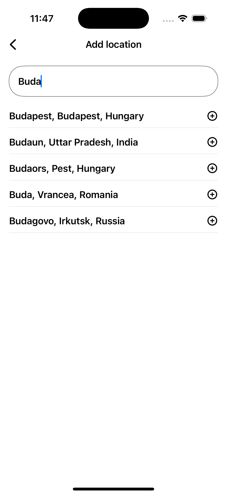

# FlatWeather 🌤️

 
 
 

**FlatWeather** is a modern, SwiftUI-based weather app for iOS, providing current weather, hourly forecasts, and multi-day forecasts.

I built this project as a portfolio piece to practice best practices in Swift development, including MVVM architecture, networking, Core Location integration, persistence, and testing.

---

## 🎥 Demo

Check out a quick demo of **FlatWeather** in action:

*Click the image to watch the demo on YouTube.*

---

## 📱 Features

- Search locations using WeatherAPI's autosuggestion tool
- Save up to 12 locations
- Display current weather conditions: temperature, feels-like, humidity, UV index, visibility, wind, precipitation
- Hourly and multi-day forecasts
- Track user location in real-time
- Localization support for English & Hungarian
- Switch dynamically between settings like Appearance, Temperature Unit, Measurement Unit

---

## ⚙️ Frameworks & Technologies

- **Xcode**
- **Swift** – Modern Swift with **async/await** concurrency
- **SwiftUI** - UI with **@Observable** state management, animations and haptics
- **REST API** - WeatherAPI (https://weatherapi.com/)
- **Core Data** - Local persistence
- **Core Location** - Location services to track user location real-time
- **Swift Charts** - Data visualization for UV Index
- **Swift Package Manager(SPM)** - Used to get access to SwiftUIPager on GitHub (https://github.com/fermoya/SwiftUIPager/)
- **XCTest** - Unit testing with mocks to be able to test without network dependency

---

## 🛠️ Architecture

- **MVVM (Model-View-ViewModel)** - Separation of concerns with protocol-driven design
- **Dependency Injection** - Custom container managing all services and viewmodels
- **Observer Pattern** - Reactive UI updates with the @Observable macro

---

## ⚡ Extra Details

- **Weather Condition Awareness** - Weather codes mapped to SF Symbols with day and night variants
- **Hourly Forecasting** - Hourly forecasts are displayed using index paths to optimize performance
- **System Settings Integration** - Dynamic unit conversion respecting user locale preferences
- **Error Handling** - Error management with localized user-friendly messages
- **Caching logic** - 15-minute cache behavior ensuring weather data freshness
- **Localization** - Available in English and Hungarian using String Catalog

---

## 🖼️ Screenshots

   

  

